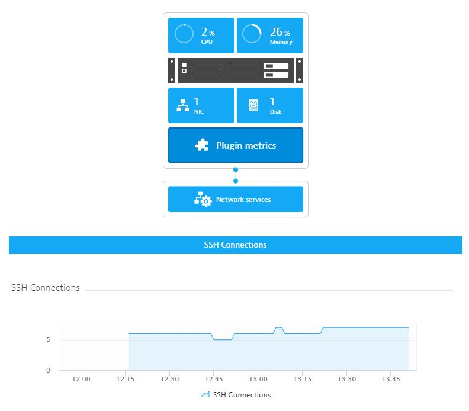

# Dynatrace OneAgent SSH Connection Extension

This is a Dynatrace OneAgent Extension for counting the number of remote SSH Connections on a Linux host.  The OneAgent can be deployed in both full-stack or Infrastructure-Only mode.

# Features

Counts the number established ssh connections by using the Linux ss command.  This creates a first class metric in Dynatrace that can be used for charting or anomoly dedection or alerting.

# Installation

1. Download the release zip file from the [releases](releases) page named custom.python.ssh_connections.zip.
2. Upload the zip file to your Dynatrace tenant in Settings > Monitoring > Monitored technologies > Custom extentions > and choose Upload extension.  More information available at [Dynatrace help](https://www.dynatrace.com/support/help/shortlink/oneagent-extensions-tutorial#upload-your-extension)
3. Unzip the zip file and transfer the contents to the /opt/dynatrace/oneagent/plugin_deployment directory on hosts with OneAgents or to appropriate plug_deployment directory if you have installed the agent into non-default directory
4. After the files have been uploaded to the UI and transfered to the appropriate directory on the desired hosts, you should now need see the SSH Connections extension listed in the Customer extensions screen.

# Configuration

There is only one configuration option for this extension which is whether or not to enable debug logging.  By default this is false and is the recommended approach to running the extension unless troubleshooting something.

# Troubleshooting

Check for any errors in the OneAgent extension logs.  The default location of this file is `/var/log/dynatrace/oneagent/plugin/ruxitagent_pluginagent_x.log`
Note: Try searching for log lines that contain `ssh_connections`

# Alternate approach

You could also use the [Dynatrace Metric scripting integration](https://www.dynatrace.com/support/help/shortlink/pipe-metric-ingestion).  The command is below for this approach, you would then need to create a cron job (or similar) to execute the command every minute.

``echo host.ssh.session.count `ss | grep -i ssh | wc -l` | /opt/dynatrace/oneagent/agent/tools/dynatrace_ingest``

# Sample
